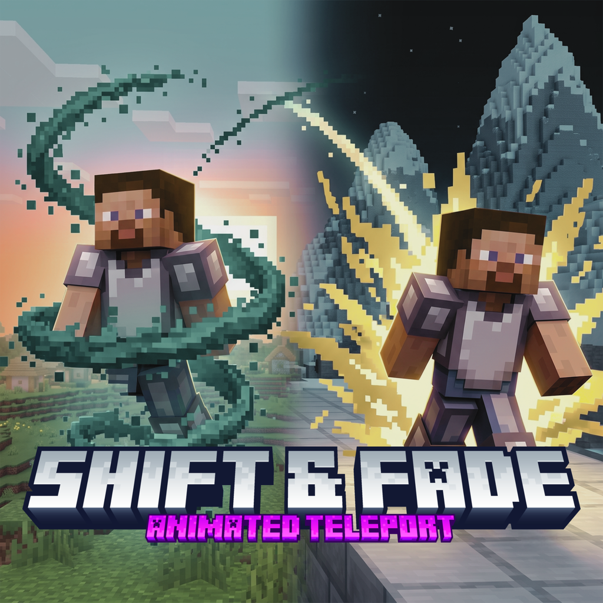

# Shift & Fade



**Shift & Fade** adds cinematic teleport transitions to Minecraft Bedrock Edition and exposes a lightweight integration API for other add-ons.

## Requirements

- Minecraft Bedrock **1.26.30 or newer**
- Behavior Pack and Resource Pack enabled
- Cheats enabled only when using the public `/sf:*` commands
- No experimental toggles required

## Teleport styles

### Grand
The camera rises vertically above the player, travels toward the destination, hides unloaded distance with a black fade when needed, then approaches and descends at the destination.

### Twilight
The camera orbits the player while dark fragments simulate a dissolve effect. The teleport occurs behind a black fade, followed by a reverse rebuild effect at the destination.

### Auto
- Grand for same-dimension teleports up to 1,000 horizontal blocks.
- Twilight for longer same-dimension teleports.

## Commands

```mcfunction
/sf:tp <x y z> [auto|grand|twilight]
/sf:send <players> <x y z> [auto|grand|twilight]
/sf:reset [players]
```

`/sf:tp` can be used by any player when cheats are enabled. `/sf:send` and `/sf:reset` require operator-level permissions.

Minecraft may report that the command leaf `tp` is already used by the vanilla command. This is informational: always run the fully namespaced command `/sf:tp`.

## API / SDK

Copy `sdk/shift_fade_sdk.js` into the add-on that owns the teleport logic. Do not import Shift & Fade's internal runtime files.

```js
import {
    requestShiftFadeTeleport,
    waitForShiftFadeAcceptance,
    waitForShiftFadeCompletion,
} from "./shift_fade_sdk.js";

const requestId = requestShiftFadeTeleport(player, destination, {
    style: "auto",
    source: "my_addon:waystone",
    teleportNearbyTamed: true,
});

const accepted = await waitForShiftFadeAcceptance(player, requestId);
if (accepted === "accepted" || accepted === "completed") {
    // Apply your cost/cooldown here.
}

const result = await waitForShiftFadeCompletion(player, requestId);
```

The integrating add-on remains responsible for permissions, costs, cooldowns, menus, messages, and deciding when a teleport is allowed.

See [docs/API.md](docs/API.md) for the full protocol.

## Limitations

- Shift & Fade does **not** replace or automatically intercept the vanilla `/tp` command.
- Animated transitions currently support destinations in the player's current dimension.
- Cross-dimension requests should use the integrating add-on's normal teleport flow.
- Camera travel near the render-distance edge may briefly request additional terrain and can produce a small local hitch on lower-powered devices.

## Vibrant Visuals

The Resource Pack declares the `pbr` capability so it does not disable Vibrant Visuals-compatible resource packs.

## Building

Run:

```bash
python tools/build.py
```

The generated `.mcpack` and `.mcaddon` files are written to `dist/`.

## 🤖 Don't know how to code? AI-assisted integration

You do not need to be an experienced JavaScript developer to integrate Shift & Fade with another Minecraft Bedrock add-on.

If you want a Waystone, Home, Warp, Fast Travel, Portal, or any other teleport system to use Shift & Fade animations, you can use the **Shift & Fade SDK** included in this repository.

If you are not familiar with the Minecraft Bedrock Script API, you can also use a coding assistant such as **ChatGPT** to help perform the integration.

### What do I need?

Provide your coding assistant with:

1. The **Behavior Pack** of the add-on you want to integrate (`.mcpack`, `.mcaddon`, `.zip`, or its source folder).
2. The **Shift & Fade SDK ZIP** from this repository.
3. Tell it which feature performs the teleport, such as:
   - Waystones
   - Homes
   - Warps
   - Fast Travel
   - Portals
   - Teleport items
   - Admin menus
4. Give it the integration prompt provided below.

The SDK contains the protocol and examples required to request an animated teleport from Shift & Fade.

You do **not** need to modify the Shift & Fade runtime itself.

The add-on being integrated should keep control of its own systems, including things such as:

- Teleport permissions
- Experience or currency costs
- Cooldowns
- Messages
- Waypoint storage
- Pets or additional entities
- Menus and UI
- Validation and restrictions

Shift & Fade should only take control of the **teleport transition itself**.

### Recommended integration behavior

A good integration should work approximately like this:

```text
Player requests teleport
        ↓
Original add-on validates the teleport
        ↓
Original add-on asks Shift & Fade to perform the transition
        ↓
Shift & Fade accepts the request
        ↓
Animated teleport plays
        ↓
Original add-on completes its normal logic
```

The original teleport should always remain available as a **fallback**.

If Shift & Fade is not installed, rejects the request, or fails to respond, the other add-on should continue using its original teleport behavior whenever possible.

This means installing Shift & Fade should enhance another add-on without making that add-on dependent on it to function.

---

### Example

Imagine a Waystone add-on normally contains something similar to:

```js
player.teleport(destination);
```

Instead of simply replacing everything around it, the integration should first understand how that Waystone system works.

For example, it may also:

- Check whether the player has enough levels
- Find nearby pets
- Apply a cooldown
- Display a message
- Play sounds
- Store Waystone information

Those systems should remain intact.

Only the actual teleport step should be connected to the Shift & Fade SDK.

---

## 🧠 AI Integration Prompt

If you use ChatGPT or another coding assistant, you can copy the prompt below and provide it together with:

- The add-on you want to modify
- The Shift & Fade SDK ZIP

The coding assistant should inspect both before making any changes.

> **Tip:** Make a backup of the original add-on and test the modified version in a copy of your world first.

---

## ⚠️ Third-party add-ons and permissions

Shift & Fade does **not** distribute modified versions, compatibility patches, or source code from third-party add-ons.

The SDK is provided so developers and users can create integrations themselves.

Before modifying another add-on, check its license, permissions, and terms to make sure you are allowed to modify it.

Do not redistribute a modified third-party add-on unless its license or author explicitly allows you to do so.

Shift & Fade's SDK does not grant permission to modify or redistribute someone else's work.

---

### Quick version

If you do not want to write a detailed request, upload both files to ChatGPT and say:

> I want to add Shift & Fade compatibility to this Minecraft Bedrock add-on. I attached both the add-on and the official Shift & Fade SDK. Read the SDK documentation and analyze how the add-on currently performs its teleport. Integrate Shift & Fade only into that teleport system, preserve all existing features, and keep the original teleport as a fallback if Shift & Fade is unavailable. Do not modify unrelated systems. When finished, give me the modified installable add-on and explain what you changed.


## License

Shift & Fade is licensed under the [MIT License](LICENSE).

## Credits

Created by **AresgettaYT**.

The project was conceptually inspired by the cinematic presentation of the Java Edition projects Grand Teleport and Twilight Teleport. Shift & Fade contains its own Bedrock implementation and original assets; it does not include their source code or assets.

Minecraft is a trademark of Microsoft. This project is not affiliated with or endorsed by Mojang Studios or Microsoft.
